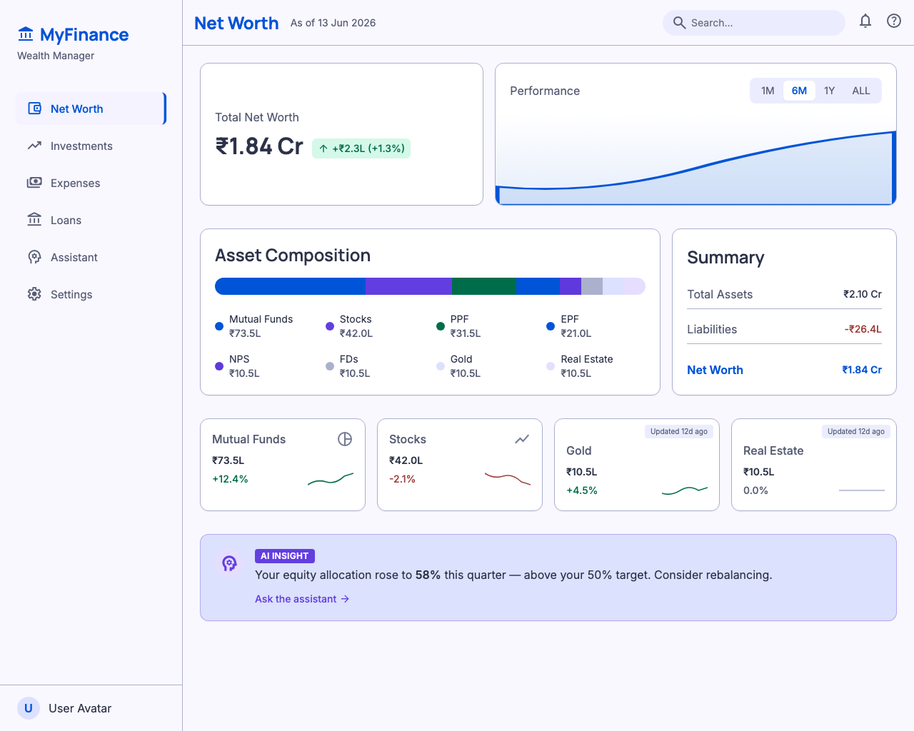
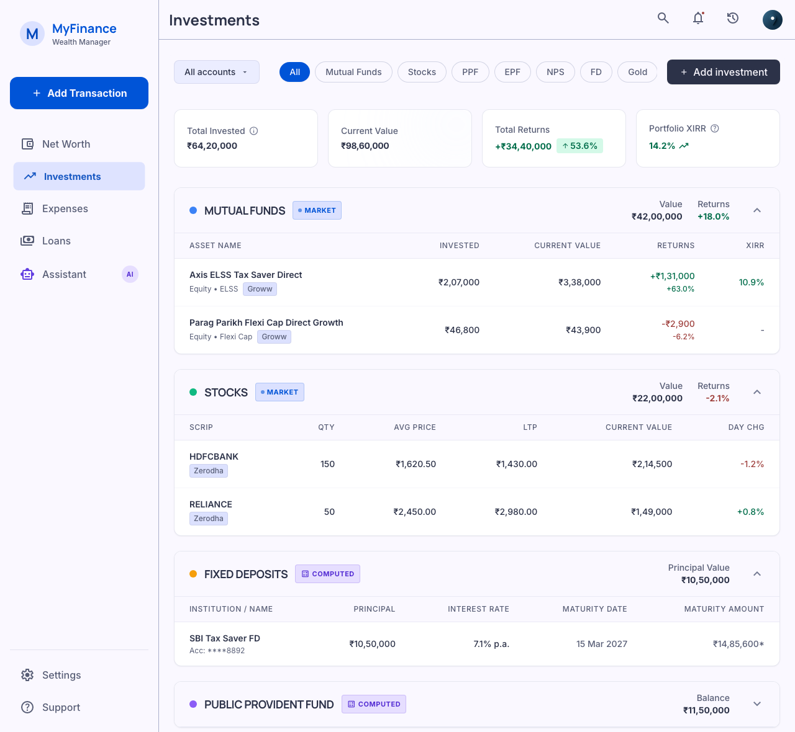
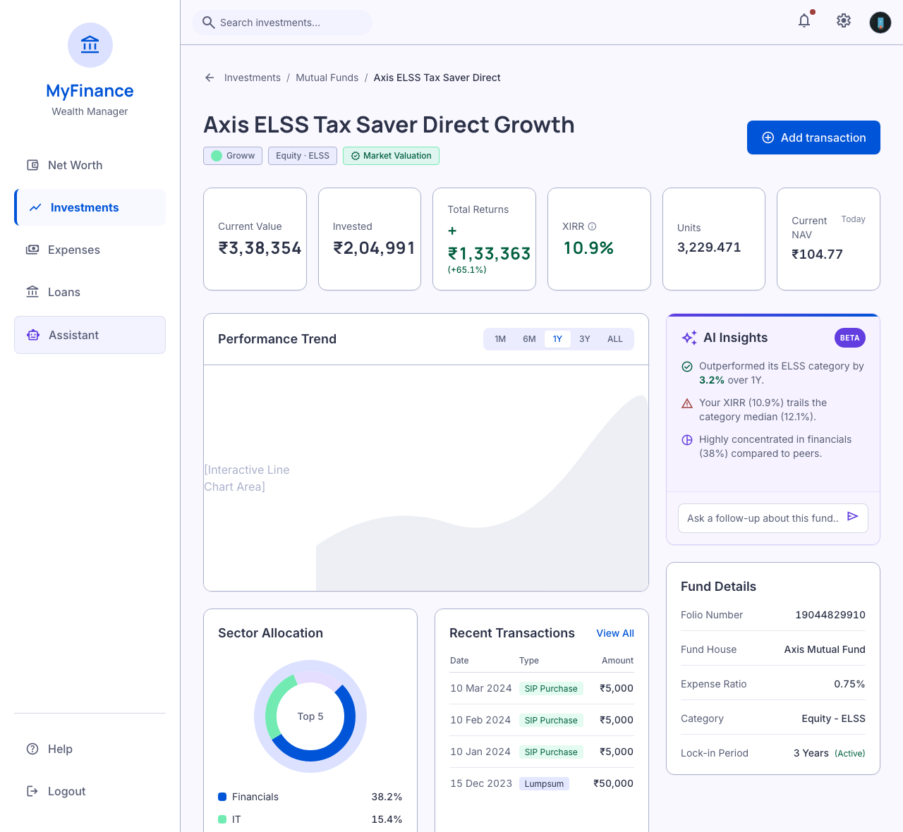
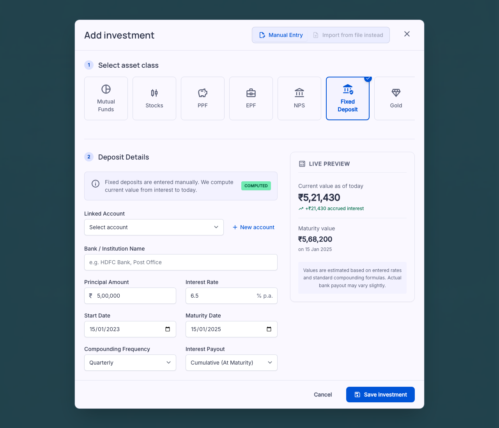
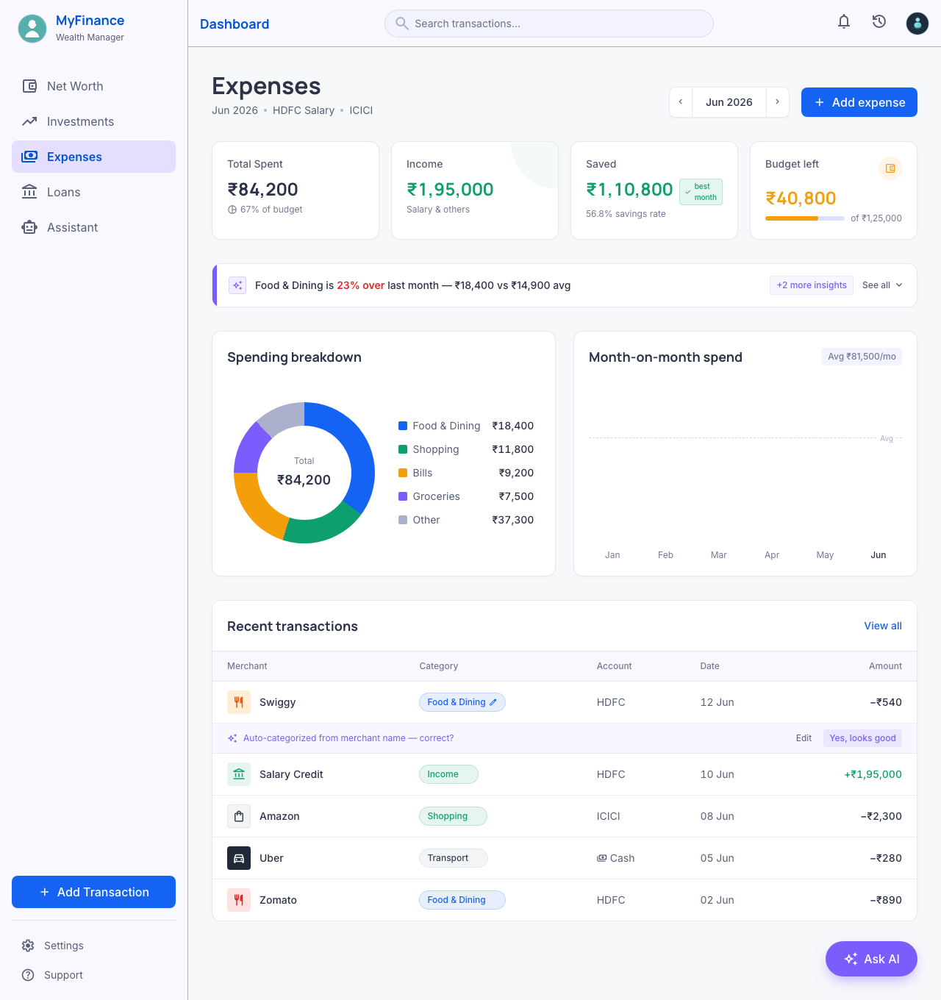
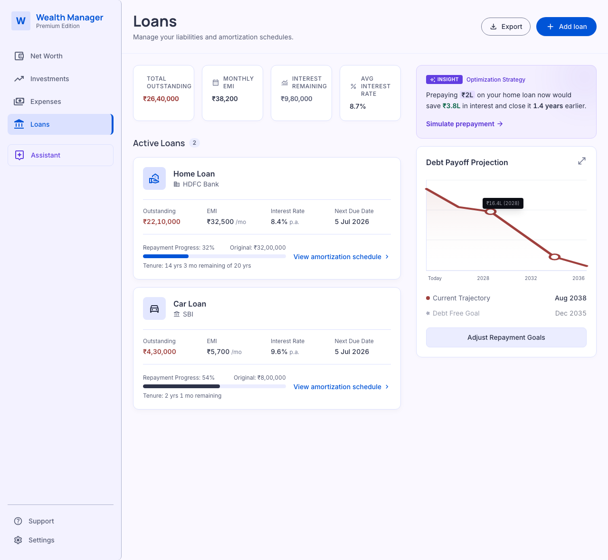

# Frontend / Platform Design Spike — MyFinance Wealth Manager

**Date:** 2026-06-13
**Type:** Design spike (brainstorm phase only — NOT a build)
**Status:** ✅ Complete. This document is a **named input** to the future **L1.5 (Unified Investment Model)** and **L2 (Web UI)** specs.
**Author:** design-spike session (T1-classified surface, run design-only per `myfinance-sdlc`)

---

## 0. What this is (and is not)

This is the standalone frontend/platform design spike mandated by the L1 close-out
(project-memory id `c5a4e601`, MASTER_PLAN §8). Its purpose: **before pouring the
L1.5 `core` schema (a T1 change with Groww re-validation), discover what the platform
must *show* — because the cheapest place to find a missing data dimension is a mockup,
not a post-migration fix.**

- **Output:** real rendered mockups (`./mockups/`) + this design doc.
- **NOT in scope:** no code, no `core` changes, no building L2. The terminal state of
  this spike is **this document** — it does **not** proceed to `writing-plans`
  (planning happens *inside* the real L1.5 / L2 layers later).
- **Tooling:** mockups generated with Stitch (Google) using a project design system,
  rendered crisply via headless Chrome. Tooling notes in project-memory id `b51b0d85`.

> **How to use this doc downstream:** §6 ("Data-model implications") is the payload
> for the L1.5 schema spec. §3–§4 (IA + screens) and §5 (cross-cutting patterns) are
> the payload for the L2 UI spec. §7 lists open decisions deliberately deferred to
> those layers.

---

## 1. Product identity

A **net-worth command-center wealth manager**: you open to a single net-worth number
and trend, with everything else as a drill-down. It tracks **all** of one person's
finances — every asset class, expenses, and liabilities — in one place, and an **AI
layer reasons over that data** to help grow wealth (the North Star; L4).

**Confirmed scope (this spike):**

- **Landing surface:** Net-worth command center (not chat-first, not a section launcher).
  AI is present everywhere but *secondary* and *on-demand*.
- **Asset classes tracked:** Mutual Funds, Stocks/Equities, PPF, EPF, NPS, Fixed
  Deposits, Gold, Real Estate, Cash. (Crypto / bonds deliberately out for now; the
  `assetClass` enum stays open so they are drop-in later.)
- **Liabilities:** first-class — Home/Car/Personal loans with balance, EMI, rate,
  tenure, and amortization. Net worth nets them out.
- **Form factor:** designed responsive, rendered at desktop width for this spike.
  Web (`apps/web`) first; mobile adapts later.

---

## 2. Information architecture (approved: "three pillars + AI")

Persistent left sidebar:

```
MyFinance
  ● Net Worth     ← landing / command center (rollup across everything)
  ● Investments   ← unified multi-asset-class portfolio (MF, stocks, PPF, FD, gold, …)
  ● Expenses      ← multi-account spend + cash flow
  ● Loans         ← first-class liabilities, netted into net worth
  ● Assistant     ← L4 "chat with your data" home (also embedded contextually everywhere)
  ─────
  Settings
```

**Why this IA:** it mirrors the money's three jobs (grow / spend / owe), which maps
**1:1 onto the L1.5 data model** (assets vs liabilities) **and onto the eventual L4
agent topology** (investment / expense / loan specialist agents under a wealth-manager
orchestrator). Keeping IA, schema, and agents congruent means each layer reinforces
the next.

Rejected: asset-class-first nav (unbounded nav, fragments the single-portfolio view);
net-worth-only contextual-drill (cross-cutting views become awkward to reach).

---

## 3. Screens (rendered mockups)

All images live in `./mockups/`. Numbers are illustrative (loosely anchored to the
real Groww golden-master figures where relevant).

### 3.1 Net-Worth Command Center — `mockups/01-networth-home.png`



The landing screen and the product's thesis in one view:

- **Hero:** one large net-worth number (₹1.84 Cr) + period delta, with a **trend chart**
  and a 1M/6M/1Y/ALL range toggle.
- **Asset Composition:** a stacked bar + legend splitting **total assets by class**
  (MF, Stocks, PPF, EPF, NPS, FDs, Gold, Real Estate), each with a colored chip.
- **Summary:** Total Assets − Total Liabilities = Net Worth (the netting is explicit).
- **Per-class KPI cards:** value + return % + sparkline. **Manually-valued classes
  (Gold, Real Estate) show an "Updated 12d ago" freshness chip** — the visible signal
  of the `manual` valuation strategy.
- **AI insight card** (violet): a single proactive observation ("equity allocation rose
  to 58% — above your 50% target; consider rebalancing") + "Ask the assistant".

### 3.2 Unified Investments Portfolio — `mockups/02-investments.png`



**All asset classes in one portfolio**, grouped by class:

- **Filter row:** Account/platform filter (`All accounts ▾`) + asset-class chips
  (All / MF / Stocks / PPF / EPF / NPS / FD / Gold) + `+ Add investment`.
- **KPI strip:** Total Invested · Current Value · Total Returns · **Portfolio XIRR**.
- **Asset-class group cards**, each with a **valuation-strategy badge**:
  - MUTUAL FUNDS → `MARKET` (per-holding invested / current / returns / **XIRR**, account tag e.g. Groww)
  - STOCKS → `MARKET` (qty / avg / LTP / current / day-change, account tag e.g. Zerodha)
  - FIXED DEPOSITS → `COMPUTED` (principal / rate / maturity date / computed maturity amount)
  - PUBLIC PROVIDENT FUND → `COMPUTED` (balance)
- The **valuation badge (market / computed / manual)** on every group is the key
  L1.5 abstraction made visible: the user always knows *how* a number was derived.

### 3.3 Investment Analyzer (single holding) — `mockups/03-investment-analyzer.png`



The canonical North-Star surface — rich analytics + AI for one holding:

- Header: fund name + tags (account · category · **Market Valuation** badge) + Add transaction.
- **KPI row:** Current Value · Invested · Total Returns · **XIRR** · Units · Current NAV.
- **Performance Trend** chart + range toggle.
- **AI Insights** card (violet, "BETA"): category-relative performance, XIRR vs category
  median, concentration — **plus an embedded "Ask a follow-up about this fund" chat input**
  (L4 embedded contextually, not just on a separate page).
- **Sector Allocation** donut + **Recent Transactions** (SIP/redemption rows) +
  **Fund Details** (folio, fund house, expense ratio, category, lock-in).

> This screen reserves layout + data slots for analytics that are *future* (sector split,
> benchmark, news) so L1.5 can leave room for them without building them now.

### 3.4 Add Investment — manual entry + computed valuation — `mockups/04-add-asset-fd.png`



The screen whose whole job is to make the **two ingestion modes** and **per-class fields**
concrete (shown with Fixed Deposit selected):

- **Ingestion-mode toggle:** `Manual Entry` ⇄ `Import from file` (top-right). FD is
  manual-only; file-import is the L1 parser-registry path for MF/stocks.
- **Asset-class picker tiles:** MF, Stocks, PPF, EPF, NPS, **Fixed Deposit (selected)**,
  Gold — the picker drives which fields appear.
- **Explicit valuation note + `COMPUTED` badge:** "Fixed deposits are entered manually.
  We compute current value from interest to today."
- **Linked Account** dropdown + "New account" (accounts are first-class).
- **Per-class fields:** Principal, Interest Rate, Compounding, Start/Maturity dates,
  Interest Payout.
- **Live valuation preview:** computed Current value (₹5,21,430), accrued interest,
  Maturity value — recomputed daily.

### 3.5 Expenses — `mockups/05-expenses.png`



(Iterated against a user-provided reference; final approved design.)

- **Full-width, no persistent side panel** (deliberate — see §5.3).
- Header: title + context subtitle (`Jun 2026 · HDFC Salary · ICICI`) + month stepper + `+ Add expense`.
- **KPI strip:** Total Spent (+ "% of budget") · Income · **Saved** ("best month") · Budget left.
- **Inline, collapsible AI insight card** (violet left-accent): one headline insight
  ("Food & Dining is 23% over last month…") + "+2 more insights · See all ▾".
- **Spending breakdown** donut + **Month-on-month spend** (simple vertical bar chart,
  6 months, current month highlighted, dashed average line). *(Per user preference, a
  plain spend-bar chart — not a multi-line trend.)*
- **Recent transactions:** editable **category chip**, **account tag** (HDFC / ICICI /
  Cash), date, amount (money-out neutral, money-in green). Includes an inline
  **auto-categorize "correct? ✓ ✗"** affordance (surfaces the categorization engine).
- **Floating "Ask AI" button** (bottom-right) opens a chat drawer on demand.

### 3.6 Loans & Liabilities — `mockups/06-loans.png`



- **KPI strip:** Total Outstanding · Monthly EMI · Interest Remaining · Avg Rate.
- **Loan cards** (Home/HDFC, Car/SBI): outstanding vs original, **repayment-progress
  bar**, rate / EMI / tenure-remaining / next-due, **"View amortization schedule"**.
- **Debt Payoff Projection** chart (current trajectory vs debt-free goal) + a violet
  **AI prepayment-optimization insight** ("Prepaying ₹2L saves ₹3.8L interest, closes
  1.4 yrs earlier").

---

## 4. Design system

Captured as a Stitch design system (`assets/2726046840844504940`) and reused across all
screens. The intent for L2:

- **Tone:** calm, data-dense, analytical — "Bloomberg-calm meets modern consumer fintech".
  Whitespace and hierarchy over flashy gradients. Trust first.
- **Color:** primary blue `#1463F3` (actions/nav); **green `#0E9F6E` / red `#E02424`
  *only* for financial deltas** (gains/losses/in/out), never decoration; **violet
  `#7C5CFC` reserved exclusively for AI** (insight cards, Assistant, "Ask AI"); near-white
  canvas `#F7F8FA`, white 12px-rounded cards, hairline borders, soft shadows. Each asset
  class gets a soft accent chip for legends/breakdowns.
- **Type:** Manrope for big money numbers + headings, Inter for body, **tabular numerals
  everywhere** so currency/percent columns align.
- **Currency:** Indian format — `₹` with lakh/crore grouping (`₹11,77,540`) and compact
  forms (`₹11.8L`, `₹1.84Cr`).
- **Primary unit:** the card (KPI / breakdown / insight). Desktop = persistent sidebar +
  multi-column dashboards.

---

## 5. Cross-cutting platform patterns

### 5.1 Valuation strategy is a first-class, *visible* concept
Every asset carries one of three valuation strategies, and the UI always shows which:

| Strategy | Means | Asset classes | UI signal |
|---|---|---|---|
| `market` | qty × live price (NAV / LTP) | MF, Stocks, Gold-ETF | `MARKET` badge; live value |
| `computed` | formula to *today* (interest / amortization) | FD, PPF, EPF, NPS, Loans | `COMPUTED` badge; daily recompute; live preview on entry |
| `manual` | user-stated value | Physical Gold, Real Estate | `MANUAL` badge + **"Updated N days ago" freshness chip** |

### 5.2 Ingestion mode is orthogonal to valuation
- `file_import` → via the **L1 parser registry** (MF/stocks broker files). Carries forward unchanged.
- `manual_entry` → CRUD form whose **fields adapt per asset class** (§3.4).
- Both modes feed the **same** normalized internal model; the "Add investment" screen
  exposes the toggle and disables import for classes that don't support it.

### 5.3 AI is embedded + on-demand, not a persistent panel
Decided during the Expenses iteration and adopted **platform-wide**:
- Each screen carries a **contextual AI insight card** (proactive, dismissible/collapsible).
- A **floating "Ask AI"** affordance opens a chat drawer **on demand** (no always-on side
  rail eating space when unused).
- Drill-down surfaces (the Analyzer, a loan) embed a **scoped "ask a follow-up"** about
  *that* entity.
- The **Assistant** nav item is the full-screen L4 home. → The L4 agent layer surfaces
  *in context* on every screen, not only as a separate destination.

### 5.4 Accounts are first-class — and scoped per asset class
- Investments and expenses both gain a real **account** dimension (today `transactions`
  has none — a single implicit account).
- **Decision (user, this spike): accounts are scoped *per asset class*, not one global
  account list.** This matches the existing schema (`accountName` / `investmentApp` on
  investment tables) and how users think ("my MF accounts" vs "my bank accounts").
  ⚠️ This is a **deliberate divergence** from the MASTER_PLAN §4 L1.5 note that mused a
  single unified accounts model shared across expenses+investments. The L1.5 spec should
  treat accounts as **per-domain** (per asset class / expense-vs-investment), not global.

---

## 6. Data-model implications for L1.5 (the payload for the schema spec)

What the mockups proved the generalized `core` schema must carry. **This is the spike's
primary deliverable** — the inputs to L1.5's T1 schema design.

1. **`assetClass` enum (open):** `mutual_fund | stock | ppf | epf | nps | fd | gold |
   real_estate | cash` — extensible (crypto/bonds later) without a schema reshape.
2. **`valuationStrategy` per asset:** `market | computed | manual`. `manual` requires a
   **`lastValuedAt`** timestamp (drives the freshness chip). `market` needs a price/NAV
   source ref. `computed` needs the inputs in (6).
3. **`ingestionMode` per asset (class-defaulted):** `file_import | manual_entry`. Does
   not change the stored model — only how rows arrive.
4. **First-class `accounts`, scoped per domain/asset-class** (§5.4), referenced by both
   investment holdings *and* expense transactions. Account = institution within a class
   (Groww, Zerodha, HDFC Bank, SBI PPF).
5. **First-class liabilities:** loans as `assetClass`-like entities with `principal`,
   `interestRate`, `tenure`, `emiAmount`, `startDate`, `outstanding` (computed), and a
   derivable **amortization schedule**. **Net worth = Σ asset values − Σ liability
   outstanding.**
6. **Per-class computed-valuation inputs:**
   - FD: principal, rate, compounding frequency, start date, maturity date, payout (cumulative/periodic).
   - PPF / EPF / NPS: balance, rate, contribution stream/cadence.
   - Gold: quantity (grams) + stated value (manual); SGB/Gold-ETF would be `market`.
   - Real estate: stated value (manual).
   - Loan: principal, rate, tenure, EMI, start → outstanding + amortization.
7. **AI insight slots** as a data concern: every rollup/holding/loan should be able to
   carry attached insights (text + severity + optional CTA) so the UI's violet cards and
   the L4 agents share one source. Reserve the seam now.
8. **Historical net-worth / valuation snapshots** — a **new dimension surfaced by the
   dashboard**: the net-worth hero + per-class trend charts + the Loans payoff projection
   all need **time series**, not just current state. L1.5 should decide how point-in-time
   net worth is stored or derived (periodic snapshots vs reconstruct-from-cashflows+price-history).
   This did not exist in the MF-only model and is the clearest "found a missing dimension
   in a mockup" outcome of the spike.
9. **Budgets** (surfaced by the Expenses screen: "% of budget", "Budget left"): a
   per-category (and/or overall) monthly budget concept. Likely an **L2 expense-reads**
   concern, but flagged here so L1.5 can decide whether budgets touch `core` or stay UI/API-side.

---

## 7. Open decisions deferred to L1.5 / L2 (intentionally not resolved here)

- **Net-worth history mechanism** (snapshot table vs derive-on-read) — §6.8. L1.5.
- **Global vs per-domain accounts** — resolved as **per-domain** (§5.4); L1.5 implements.
- **Budgets in `core` vs API/UI layer** — §6.9. L1.5/L2.
- **Live price sources** for `market` assets (stocks LTP, gold price) — L1.5 picks providers;
  reuse the L1 NAV (mfapi.in) pattern. Out of scope for this spike.
- **Multi-currency / multi-member** — out of scope (single-user, INR). Not designed.
- **Enriched expense reads** (date-range / direction / search filters, `/expenses/summary`,
  category breakdowns) — these were *already* deferred from L1 to L2 "to design against
  concrete layouts"; the §3.5 Expenses mockup is now that concrete layout. L2.

---

## 8. Mockup inventory

| # | Screen | File | Status |
|---|---|---|---|
| 1 | Net-Worth Command Center | `mockups/01-networth-home.png` | ✅ |
| 2 | Unified Investments Portfolio | `mockups/02-investments.png` | ✅ |
| 3 | Investment Analyzer (single holding) | `mockups/03-investment-analyzer.png` | ✅ |
| 4 | Add Investment (manual / computed — FD) | `mockups/04-add-asset-fd.png` | ✅ |
| 5 | Expenses (cash flow + on-demand AI) | `mockups/05-expenses.png` | ✅ |
| 6 | Loans & Liabilities | `mockups/06-loans.png` | ✅ |
| — | Reference (user-provided inspiration for Expenses) | `mockups/inspiration-expenses.png` | ref |

Not rendered (described, low novelty): full-screen **Assistant** (L4 chat home — designed
in L4), import-from-file flow (the L1 multipart path, already built), per-class manual
forms other than FD (same pattern as §3.4 with class-specific fields from §6.6).

---

## 9. Spike outcome

The core L1.5 abstractions — **assetClass × (valuationStrategy, ingestionMode) +
first-class per-domain accounts + first-class liabilities + a net-worth rollup** — are
sound and render naturally into an intuitive, premium UI. The spike additionally
surfaced two dimensions to bake into the L1.5 schema **before** migration:
**(a) historical net-worth / valuation snapshots** (§6.8) and **(b) budgets** (§6.9),
plus the platform-wide pattern that **AI is embedded + on-demand** (§5.3) and **accounts
are per-domain, not global** (§5.4, a deliberate divergence from the prior plan note).

**Next:** start **L1.5 — Unified Investment Model + first-class Accounts** as a fresh T1
cycle, using §6 as the schema input and §3–§5 as the UI contract for L2. (Also merge L1
PR #2 to `main` when ready.) This spike does **not** proceed to `writing-plans`.
